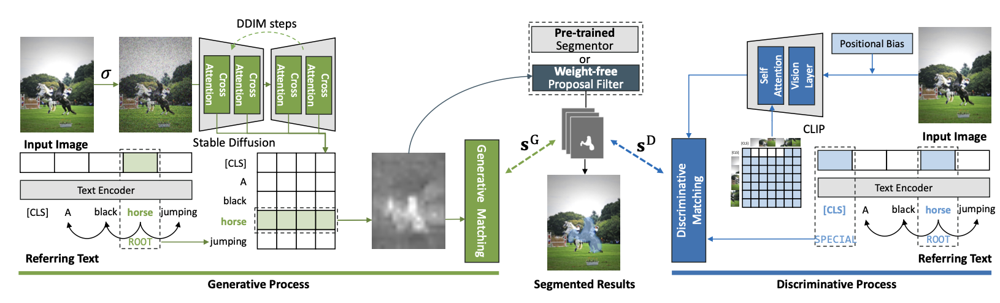

# Ref-Diff: Zero-shot Referring Image Segmentation with Generative Models

This is an official PyTorch implementation of the [Ref-Diff](https://arxiv.org/pdf/2308.16777)

## Abstract

Zero-shot referring image segmentation (RIS) is a challenging task that involves identifying an instance segmentation mask based on referring descriptions, without having been trained on such paired data. Current zero-shot RIS methods mainly rely on pre-trained discriminative models (e.g., CLIP). However, this study explores the potential of generative models (e.g., Stable Diffusion) in understanding relationships between various visual elements and text descriptions, an area that has not been fully investigated in this context. In this work, we introduce the Referring Diffusional Segmentor (Ref-Diff), a model that harnesses the fine-grained multi-modal information provided by generative models. Our results demonstrate that Ref-Diff, using only a generative model and no external proposal generator, outperforms state-of-the-art weakly-supervised models on the RefCOCO+ and RefCOCOg benchmarks. Furthermore, when we combine both generative and discriminative models, our enhanced version, Ref-Diff+, significantly surpasses competing methods. This underscores the valuable role of generative models, which offer complementary benefits to discriminative models, thereby improving referring segmentation.

<p align="center">
  
</p>


## Quick Start

The detailed instruction of dataset is in [prepare_datasets.md](tools/prepare_datasets.md)

To do evaluation of Ref-Diff, run:
```
# e.g., Evaluation on the val-set of the RefCOCO dataset
CUDA_VISIBLE_DEVICES=0 python -u test.py \
      --config config/refcoco.yaml
```

## License

This project is under the MIT license. See [LICENSE](LICENSE) for details.

## Citation
If you find our work useful in your research, please consider citing:
```
@article{ni2023refdiff,
  title={Ref-Diff: Zero-shot Referring Image Segmentation with Generative Models},
  author={Minheng Ni, Yabo Zhang, Kailai Feng, Xiaoming Li, Yiwen Guo, Wangmeng Zuo},
  journal={arXiv preprint arXiv:2308.16777},
  year={2023}
}
```
